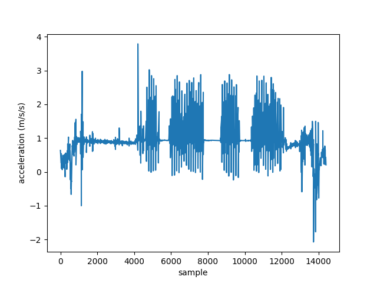

# Tutorial: Step detection

This example shows how to detect steps and phases of gait using a single Axivity worn on the right ankle.

## Import libraries

Import the **nimbalwear** package, along with some plotting and computing libraries to help visualize the data:

```
import nimbalwear as nw
import matplotlib.pyplot as plt
import numpy as np
from scipy import ndimage
```

## Loading Axivity data

In this example, an Axivity sensor was placed on the right ankle. First, we need to instantiate a `Device` object, and then use the `import_axivity()` method to hold the raw .CWA data.

```
ax_device = nw.data.Device()
ax_device.import_axivity('right_ankle.cwa')
```

## Plot raw data

The data channels for the sensor can be listed using the `signal_headers` property

```
ax_device.signal_headers
```
```
[{'label': 'Accelerometer x',
  'transducer': 'MEMS',
  'dimension': 'g',
  'sample_rate': 100.0,
  'physical_max': 3.16064453125,
  'physical_min': -4.721923828125,
  'digital_max': 32767,
  'digital_min': -32768,
  'prefilter': ''},
 {'label': 'Accelerometer y',
  'transducer': 'MEMS',
  'dimension': 'g',
  'sample_rate': 100.0,
  'physical_max': 3.7880859375,
  'physical_min': -2.07373046875,
  'digital_max': 32767,
  'digital_min': -32768,
  'prefilter': ''},
 {'label': 'Accelerometer z',
  'transducer': 'MEMS',
  'dimension': 'g',
  'sample_rate': 100.0,
  'physical_max': 4.8095703125,
  'physical_min': -3.11279296875,
  'digital_max': 32767,
  'digital_min': -32768,
  'prefilter': ''},
  ...
  ]
```

And the index for each signal can be found using the `get_signal_index()` method. In this case, we want to find the index of the vertical acceleration direction (y-axis) in order to detect steps:

```
ax_device.get_signal_index('Accelerometer y')
```
```
1
```

The returned index is 1, referring to the second data stream (as expected from the signal header outputs above).

We can now plot the corresponding raw data using the `signals` property and the signal index:

```
vert_acc_index = ax_device.get_signal_index('Accelerometer y')
vert_acc_data = ax_device.signals[vert_acc_index]

plt.plot(vert_acc_data)
plt.show()
```

