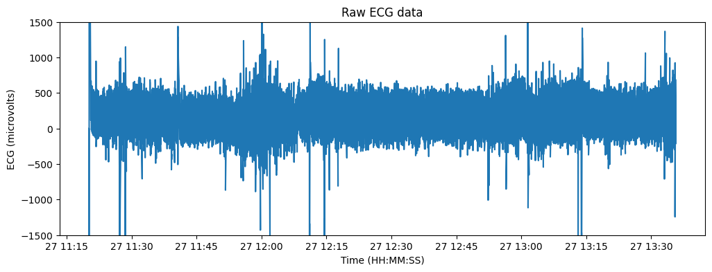
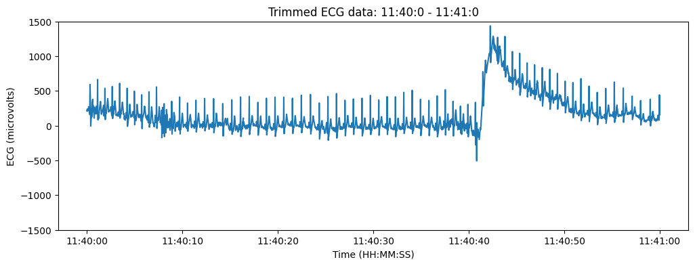
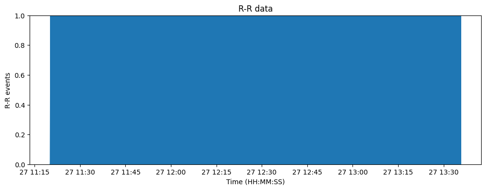
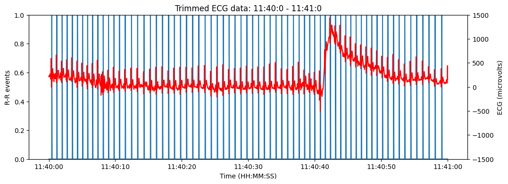

# ECG - HRV Tutorial

First, import the relevant modules (matplotlib, numpy, and nimbalwear) and helper scripts (from https://github.com/neurocog-mobility/scripts):


```python
# external modules
import matplotlib.pyplot as plt
import numpy as np
import nimbalwear as nw
# helper scripts
from utils import moving_window_average, trim_data
from helper_ecg import compute_hrv, pan_tompkins_detector, ecg2rr
```

Create a bittium device object and read in .EDF file:


```python
bittium_device = nw.data.Device()
bittium_device.import_bittium('ecg.EDF')

print(bittium_device)
```

    Reading /home/abdulzaf/github/development/nimbal_toolkit/scripts/ecg.EDF ...
    <nimbalwear.data.Device object at 0x785c1f7885e0>


Visualize the ECG data from the 1st ECG channel ('ECG_1'):


```python
lbl = 'ECG_1'
fs = bittium_device.signal_headers[bittium_device.get_signal_index(lbl)]['sample_rate']
ecg = bittium_device.signals[bittium_device.get_signal_index(lbl)]
time = bittium_device.get_timestamps(lbl, 'datetime')

print(f"ECG sampling frequency: {fs}Hz")

plt.figure(figsize=(12,4))
plt.title('Raw ECG data')
plt.plot(time, ecg)
plt.ylim(-1500, 1500)
plt.xlabel('Time (HH:MM:SS)')
plt.ylabel('ECG (microvolts)')
```

    /usr/local/lib/python3.10/dist-packages/nimbalwear/data.py:236: FutureWarning: 'S' is deprecated and will be removed in a future version, please use 's' instead.
      ts = pd.date_range(start, freq=freq, periods=per)


    ECG sampling frequency: 125.0Hz


    Text(0, 0.5, 'ECG (microvolts)')


    

    


Use the *trim_data()* function to select a specific time window of the ECG:


```python
win_ts = [2023, 10, 27, 11, 40, 0]
win_te = [2023, 10, 27, 11, 41, 0]
win_time_ecg, win_ecg = trim_data(bittium_device, lbl, win_ts, win_te)

plt.figure(figsize=(12,4))
plt.title(f'Trimmed ECG data: {win_ts[3]}:{win_ts[4]}:{win_ts[5]} - {win_te[3]}:{win_te[4]}:{win_te[5]}')
plt.plot(win_time_ecg, win_ecg)
plt.ylim(-1500, 1500)
plt.xlabel('Time (HH:MM:SS)')
plt.ylabel('ECG (microvolts)')
```


    Text(0, 0.5, 'ECG (microvolts)')


    

    


Detect R-R intervals using the *ecg2rr()* function, which uses the Pan-Tompkins algorithm.
Then add the R-R signal of events to the Bittium device and visualize:


```python
rr = ecg2rr(fs, ecg)
bittium_device.signals.append(rr)
bittium_device.signal_headers.append({
    'label': 'RR',
    'transducer': 'processed',
    'dimension': 'binary',
    'sample_dr': int(fs),
    'sample_rate': fs,
    'physical_max': 1,
    'physical_min': 0,
    'digital_max': 1,
    'digital_min': 0,
    'prefilter': ''
    })

plt.figure(figsize=(12,4))
plt.title('R-R data')
plt.plot(time[:len(rr)], rr)
plt.ylim(0, 1)
plt.xlabel('Time (HH:MM:SS)')
plt.ylabel('R-R events')
```


    Text(0, 0.5, 'R-R events')


    

    


Trim R-R to a specific time window:


```python
win_time_rr, win_rr = trim_data(bittium_device, "RR", win_ts, win_te)

plt.figure(figsize=(12,4))
plt.title(f'Trimmed ECG data: {win_ts[3]}:{win_ts[4]}:{win_ts[5]} - {win_te[3]}:{win_te[4]}:{win_te[5]}')
plt.plot(win_time_rr, win_rr)
plt.ylim(0, 1)
plt.xlabel('Time (HH:MM:SS)')
plt.ylabel('R-R events')

plt.gca().twinx().plot(win_time_ecg, win_ecg, 'r')
plt.ylim(-1500, 1500)
plt.xlabel('Time (HH:MM:SS)')
plt.ylabel('ECG (microvolts)')
```


    Text(0, 0.5, 'ECG (microvolts)')


    

    


Compute the HRV from the RMSSD metric using the *compute_hrv()* function:


```python
print(f'Window HRV: {1000*compute_hrv(win_rr, fs)}ms')
```

    Window HRV: 34.73597897417197ms

